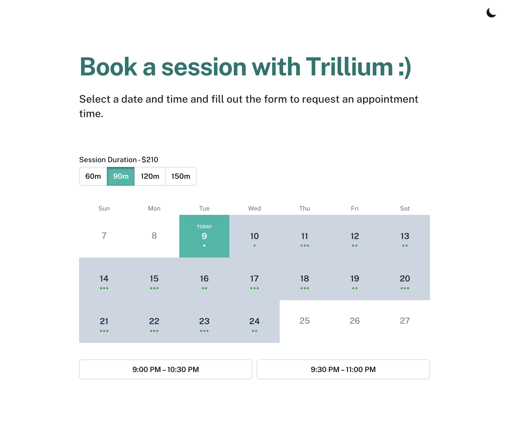

<!-- <a name="readme-top"></a>

## Hello world! 👋

This is my first project. I’m Tim, currently an out-of-work Product Manager. Gotta love 2023. I’ve worked at companies like Google, Meta and Tripadvisor (as a PM), but have always enjoyed hobbyist coding.

For some weird reason, I’ve been interested in a personal self-scheduling solution (like Calendly, Cal.com), but one that's simple, free, and without branding or bloat.

**So, I made my own Calendly alternative, and wanted to share with the world and walk through it.**


The current solution is intentionally lightweight and opinionated, but hopefully flexible enough should you want to extend it.

* Requires **Google Calendar** and **Gmail** APIs _(sorry, no Outlook, iCloud; but parsing an ICS feed isn't hard to do!)_
* Supports **multiple calendars** for calculating availability.
* Only has **basic availability configuration** built in, e.g. you can specify working hours based on day of week only. 
* Currently optimized for meetings via **phone** or **Google Meet** _(vs. in-person or using resources)._

The workflow is simple enough, and we'll walk through it later, but basically:

1. A user requests an appointment.
2. The system emails you asking you to confirm or deny.
3. Once confirmed, it's emailed to the user and added to both of your calendars. 

As I mentioned, it's opinionated and designed for simple use cases for individuals in mind. 😁

Some technical notes:
* Uses Next.js 13 and Typescript with Tailwind.
* Has (some) testing on the more trickier functions.
* Uses minimal libraries. For instance, I built my own lightweight wrapper to hit Google APIs directly to avoid importing `googleapis`. 
* Probably has some over-engineered bits that feel nice, like `lru-cache` limiting on API endpoints, a more intuitive timezone selection piece, and formatted emails. 

I welcome feedback and suggestions; and have fun!

See related post at https://dev.to/timfee/build-and-host-your-own-calendy-like-scheduling-page-using-nextjs-and-google-apis-5ack


# Welcome to my massage therapy booking site :)


This booking tool is made with:

- [Next.js](https://nextjs.org/)
- [Tailwind CSS](https://tailwindcss.com/)

This tool is a in progress, with some imporvements being committed upstream.

## Technical Notes

See Roadmap

## Contributions

If you notice something off, or UI discrepancies please let me know either by creating a [new issue](https://github.com/Spiteless/www-massage/issues/new/choose) or making a fork to fix this issue on your own. Either is welcome and encouraged! -->


<a name="readme-top"></a>

<h3 align="center">Trillium Massage booking Site</h3>

<div align="center">
<a href="https://trilliumsmith.com">
 <picture>
  <source media="(prefers-color-scheme: dark)" srcset="public/banner_dark.png">
  
 </picture>
 </a>
</div>


<!-- PROJECT SHIELDS -->
<!--
*** I'm using markdown "reference style" links for readability.
*** Reference links are enclosed in brackets [ ] instead of parentheses ( ).
*** See the bottom of this document for the declaration of the reference variables
*** for contributors-url, forks-url, etc. This is an optional, concise syntax you may use.
*** https://www.markdownguide.org/basic-syntax/#reference-style-links
-->
[![Contributors][contributors-shield]][contributors-url]
[![Forks][forks-shield]][forks-url]
[![Stargazers][stars-shield]][stars-url]
[![Issues][issues-shield]][issues-url]
[![MIT License][license-shield]][license-url]
[![Netlify][netlify-shield]][Site-url]
[![LinkedIn][linkedin-shield]](https://www.linkedin.com/in/trilliumsmith/)


<div align="center">
  <p align="center">
    <div align="left">
    Simple booking tool that offers availability through open slots in your Google calendar. 
    </div>
    <br />
    <a href="https://trilliummassage.la">Live Site</a>
    ·
    <a href="https://github.com/Spiteless/www-massage/issues/new?labels=bug&template=bug-report---.md">Report Bug</a>
    ·
    <a href="https://github.com/Spiteless/www-massage/issues/new?labels=enhancement&template=feature-request---.md">Request Feature</a>
  </p>
</div>

<!-- TABLE OF CONTENTS -->
<details>
  <summary>Table of Contents</summary>
  <ol>
    <li>
      <a href="#about-the-project">About The Project</a>
      <ul>
        <li><a href="#built-with">Built With</a></li>
      </ul>
    </li>
    <li>
      <a href="#getting-started">Getting Started</a>
      <ul>
        <!-- <li><a href="#prerequisites">Prerequisites</a></li> -->
        <li><a href="#installation">Installation</a></li>
      </ul>
    </li>
    <!-- <li><a href="#usage">Usage</a></li> -->
    <li><a href="#roadmap">Roadmap</a></li>
    <li><a href="#contributing">Contributing</a></li>
    <li><a href="#license">License</a></li>
    <li><a href="#acknowledgments">Acknowledgments</a></li>
    <li><a href="#contact">Contact</a></li>
  </ol>
</details>


<!-- ABOUT THE PROJECT -->
## About The Project

This prject is meant to be a simple and extensible booking utility for massage therapists and other solopreneur professionals. 

<p align="right">(<a href="#readme-top">back to top</a>)</p>


### Built With

<div align="center">

[![Next][Next.js]][Next-url]
[![React][React.js]][React-url]
[![Tailwindcss][Tailwindcss.com]][JQuery-url] 
</div>

<p align="right">(<a href="#readme-top">back to top</a>)</p>


<!-- GETTING STARTED -->
## Getting Started

This is an example of how you may give instructions on setting up your project locally.
To get a local copy up and running follow these simple example steps.

### Prerequisites

This is an example of how to list things you need to use the software and how to install them.

* npm
  ```sh
  npm install npm@latest -g
  ```

### Installation

1. Clone the repo
   ```sh
   git clone https://github.com/Spiteless/www-massage.git
   ```
2. Install NPM packages via `yarn`
   ```sh
   yarn install
   ```

<p align="right">(<a href="#readme-top">back to top</a>)</p>


<!-- USAGE EXAMPLES -->


<!-- ## Usage -->
<!-- Fill in later -->
<!-- <p align="right">(<a href="#readme-top">back to top</a>)</p> -->


<!-- ROADMAP -->
## Roadmap

- [x] Switch to NextJS App Router
- [x] Dark mode option
- [x] Tailwind primary/secondary color scheme 
- [x] Check free/busy on multiple calendars
- [ ] Easier customization  
- [ ] Better email templates
- [ ] Integration with Payment Processors
- [ ] Sub-appointment blocks


See the [open issues](https://github.com/Spiteless/www-massage/issues) for a full list of proposed features (and known issues).

<p align="right">(<a href="#readme-top">back to top</a>)</p>


<!-- CONTRIBUTING -->
## Contributing

Contributions are what make the open source community such an amazing place to learn, inspire, and create. Any contributions you make are **greatly appreciated**.

If you have a suggestion that would make this better, please fork the repo and create a pull request. You can also simply open an issue with the tag "enhancement".
Don't forget to give the project a star 🌟! Thanks again!

1. Fork the Project
2. Create your Feature Branch (`git checkout -b feature/AmazingFeature`)
3. Commit your Changes (`git commit -m 'Add some AmazingFeature'`)
4. Push to the Branch (`git push origin feature/AmazingFeature`)
5. Open a Pull Request

<p align="right">(<a href="#readme-top">back to top</a>)</p>


<!-- LICENSE -->
## License

- Original work [MIT](https://github.com/timfee/meet/blob/main/LICENSE) © [Tim Feely](https://github.com/timfee)
- Modifications [MIT](https://github.com/spiteless/www-massage/blob/main/LICENSE) © [Trillium Smith](http://trilliumsmith.com)


<p align="right">(<a href="#readme-top">back to top</a>)</p>


<!-- ACKNOWLEDGMENTS -->
## Acknowledgments

* [Tim Feely](https://github.com/timfee) for creating the initial framework that this prject uses.
* [Google Calendar API](https://developers.google.com/calendar/api/guides/overview) for providing a fantastic API to build off of.

<p align="right">(<a href="#readme-top">back to top</a>)</p>


<!-- CONTACT -->
## Contact

Trillium Smith - trillium@trilliumsmith.com

Project Link: [https://github.com/Spiteless/www-massage](https://github.com/Spiteless/www-massage)

<p align="right">(<a href="#readme-top">back to top</a>)</p>


<!-- MARKDOWN LINKS & IMAGES -->
<!-- https://www.markdownguide.org/basic-syntax/#reference-style-links -->
[contributors-shield]: https://img.shields.io/github/contributors/Spiteless/www-massage.svg?style=for-the-badge
[contributors-url]: https://github.com/Spiteless/www-massage/graphs/contributors
[forks-shield]: https://img.shields.io/github/forks/Spiteless/www-massage.svg?style=for-the-badge
[forks-url]: https://github.com/Spiteless/www-massage/network/members
[stars-shield]: https://img.shields.io/github/stars/Spiteless/www-massage.svg?style=for-the-badge
[stars-url]: https://github.com/Spiteless/www-massage/stargazers
[issues-shield]: https://img.shields.io/github/issues/Spiteless/www-massage.svg?style=for-the-badge
[issues-url]: https://github.com/Spiteless/www-massage/issues
[license-shield]: https://img.shields.io/github/license/Spiteless/www-massage.svg?style=for-the-badge
[license-url]: https://github.com/Spiteless/www-massage/blob/main/LICENSE.txt
[linkedin-shield]: https://img.shields.io/badge/-LinkedIn-black.svg?style=for-the-badge&logo=linkedin&colorB=555
[linkedin-url]: https://linkedin.com/in/trilliumsmith
[product-screenshot]: images/screenshot.png
[Next.js]: https://img.shields.io/badge/next.js-000000?style=for-the-badge&logo=nextdotjs&logoColor=white
[Next-url]: https://nextjs.org/
[React.js]: https://img.shields.io/badge/React-20232A?style=for-the-badge&logo=react&logoColor=61DAFB
[React-url]: https://reactjs.org/
[Vue.js]: https://img.shields.io/badge/Vue.js-35495E?style=for-the-badge&logo=vuedotjs&logoColor=4FC08D
[Vue-url]: https://vuejs.org/
[Angular.io]: https://img.shields.io/badge/Angular-DD0031?style=for-the-badge&logo=angular&logoColor=white
[Angular-url]: https://angular.io/
[Svelte.dev]: https://img.shields.io/badge/Svelte-4A4A55?style=for-the-badge&logo=svelte&logoColor=FF3E00
[Svelte-url]: https://svelte.dev/
[Laravel.com]: https://img.shields.io/badge/Laravel-FF2D20?style=for-the-badge&logo=laravel&logoColor=white
[Laravel-url]: https://laravel.com
[Bootstrap.com]: https://img.shields.io/badge/Bootstrap-563D7C?style=for-the-badge&logo=bootstrap&logoColor=white
[Bootstrap-url]: https://getbootstrap.com
[JQuery.com]: https://img.shields.io/badge/jQuery-0769AD?style=for-the-badge&logo=jquery&logoColor=white
[JQuery-url]: https://jquery.com 
[Tailwindcss.com]: https://img.shields.io/badge/Tailwind_CSS-38B2AC?style=for-the-badge&logo=tailwind-css&logoColor=white
[Tailwind-url]: https://tailwindcss.com 
[Site-url]: https://trilliummassage.la
[netlify-shield]: https://img.shields.io/netlify/6387ba9f-85f8-4149-83a0-69b7b1a33775?style=for-the-badge